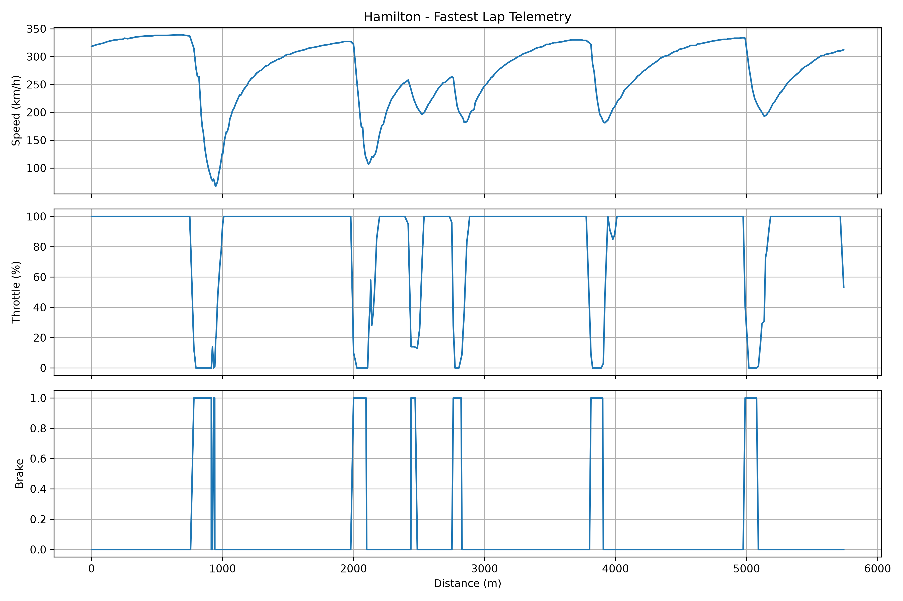

# AI-Motorsport-Telemetry



## Project Overview

AI-Motorsport-Telemetry is a personal motorport engineering project focused on Formula 1 telemetry analysis and AI-assisted performance engineering.

The goal of this project is to explore how telemetry data, data science and machine learning can be used to understand driver behaviour and vehicle performance.

This project also documents my transition from Quantum Computing research to Artificial Intelligence applications in Motorsport.

---

## Current Features

- Load Formula 1 telemetry using FastF1
- Retrieve the fastest lap of a session
- Extract telemetry data
- Visualize:
  - Speed vs Distance 
  - Throttle vs Distance 
  - Brake vs Distance
- Automatically save generated figures

---

## Project Structure

```text
AI-Motorsport-Telemetry/

├── data/
├── figures/
├── notebooks/
├── src/
└── README.md
```

---

## Technologies

- Python
- FastF1
- Pandas
- Matplotlib
- Git & GitHub
- Scikit-learn *(planned)*

---

## Roadmap 

- [x] Load telemetry data
- [x] Plot Speed vs Distance
- [x] Create telemetry dashboard
- [ ] Driver comparison 
- [ ] Corner detection
- [ ] Lap time comparison 
- [ ] Machine Learning models
- [ ] AI-assisted performance engineer
- [ ] Understeer / Oversteer estimation

---

## Long-Term Goal

Develop an AI-assisted motorsport telemetry analysis tool capable of supporting performance engineers by analysing driver behaviour and identifying opportunities for lap time improvement.

---

## Author 

**Rania Giourtsidou**

Physics • Quantum Technologies • Artificial Intelligence • Motorsport Engineering